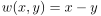
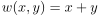
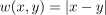
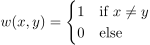
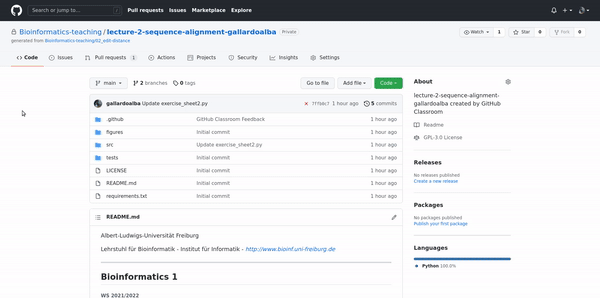

Albert-Ludwigs-Universität Freiburg

Lehrstuhl für Bioinformatik - Institut für Informatik - *http://www.bioinf.uni-freiburg.de*

---
## Bioinformatics 1
###### WS 2021/2022
##### Exercise sheet 2: Edit operations and alignments
---
### _Exercise 1 - Levenshtein Distance_
Compute the minimal Levenshtein edit distance for the following pairs of sequences.

**a)** &nbsp;S1='A'&nbsp;&nbsp;&nbsp;&nbsp;&nbsp;&nbsp;&nbsp;&nbsp;&nbsp;&nbsp;&nbsp;&nbsp;&nbsp;&nbsp;&nbsp;&nbsp;&nbsp;S2='T'

**b)** &nbsp;S1=AGATATA&nbsp;&nbsp;&nbsp;&nbsp;&nbsp;&nbsp;S2=TATATATA

**c)** &nbsp;S1=AGTCCT&nbsp;&nbsp;&nbsp;&nbsp;&nbsp;&nbsp;S2=CGCTCA

**d)** &nbsp;S1=TGCATAT&nbsp;&nbsp;&nbsp;&nbsp;&nbsp;S2=ATCCGAT

**e)** &nbsp;S1=ATCCGAT&nbsp;&nbsp;&nbsp;&nbsp;&nbsp;S2=TGCATAT

### _Exercise 2 - Metric function_
Check if the corresponding functions are metric.

**a)** &nbsp;&nbsp;

**b)** &nbsp;&nbsp;

**c)** &nbsp;&nbsp;

**d)** &nbsp;&nbsp;


### _Exercise 3 - Programming assignment: Levenshtein Distance_

**a)** Implement the function **levenshtein_substitution()** which takes two sequences of the same length and computes the minimum number of substitutions to transform one into another.

**b)** Implement the function **levenshtein_deletion()** which takes two sequences of different length and returns the positions of characters from the longest sequences which should be deleted to transform the sequence into the other one. If such deletion can not be done the function should return *None*.

---

#### Recommended good practices

Here we have included some best practices to help you solve the exercises as efficiently as possible. First, clone the assinment repository.
    

```
$ git clone git@github.com:Bioinformatics-teaching/lecture-2-sequence-alignment-userID.git

```

Do not forget to use your own user ID. Now, answers the questions.


```
$ cd lecture-2-sequence-alignment-userID
$ emacs -nw src/exercise_sheet2.py
    
```

Include the changes and make a commit describing the modifications.


```
$ git add src/exercise_sheet2.py
$ git commit -m "Description of your modifications"

```

 
Send your results.       


```
$ git push
```

Done! But, it would be nice to know something about the score, wouldn't it? Let's check the autograding results. This PR will also be used by the teachers to include specific comments.


